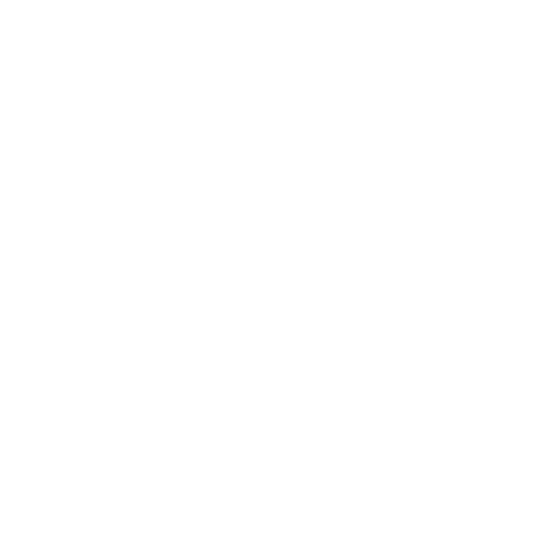

<!-- Repository Name. Preferrably 1-5 words long. -->
<p align="center">
    
</p>

<h1 align="center" style="font-weight: bold">
    <span id="min-block-shrink">▀▄▀▄▀▄</span>
    <span id="min-block">${title}</span>
    <span id="min-block-shrink">▀▄▀▄▀▄</span>
</h1>


<!-- Description. Preferrably 1 sentence long. -->
<h3 align="center" style="font-weight: bold">
    WIP: Manga Downloader
</h3>

<p align="center">
    <a href="https://github.com/${organization}/${repo_name}/issues">
        
    </a>
    <a href="https://github.com/${organization}/${repo_name}/network/members">
        
    </a>
    <a href="https://github.com/${organization}/${repo_name}/network/members">
        
    </a>
    <a href="https://github.com/${organization}/${repo_name}/graphs/contributors">
        
    </a>
</p>
<p align="center">
	<a href="https://github.com/${organization}/${repo_name}/blob/master/docs/LICENSE.md">
        
    </a>
</p>
<p align="center">
    <a target="_blank" href="https://discord.com/invite/${dc_inv}">
        
    </a>
</p>

<!-- About section. Preferrably 2-5 sentences long. -->
---

<h4 align="center">
The most inefficient manga downloader for PC (and soon, also a reader)
</h4>

---

> **❝** *...but I don't think you'll write code valuable enough for them (Content creators and/or owners) to do that (file a DMCA strike against MangDL).* **❞**
>
> \- <a href='https://github.com/justfoolingaround'>KR</a>

Github: [github.com/${organization}/${repo_name}](https://github.com/${organization}/${repo_name})

Website: [${site}](http://${site})

## **Important**

This project is a work in progress. A package will be released soon as a beta.

To be updated, be sure to watch this repository and join the [Discord Support Server](https://discord.com/invite/${dc_inv}) for MangDL.

For the terms of usage and legals, visit [license](license.md) and [terms of usage & disclaimer](tou_disc.md).

## **Features**

- Ad free
- Batch downloading
- 0% tracking and analytics
- Can be used as a library

### Supported OSes

- Windows
- MacOS
- Linux

## **Sites**

- [acescans.xyz](https://acescans.xyz)
- [danke.moe](https://danke.moe)
- [flamescans.org](https://flamescans.org)
- [hachirumi.com](https://hachirumi.com)
- [mangadex.org](https://mangadex.org)
- [manganato.com](https://manganato.com)

### Coming soon™

- [assortedscans.com](https://assortedscans.com)
- [bunko.ml](https://bunko.ml)
- [deathtollscans.net](https://deathtollscans.net)
- [mangapill.com](https://mangapill.com/)
- [mangareader.to](https://mangareader.to)
- [mangarock.to](https://mangarock.to)
- [setsuscans.com](https://setsuscans.com/)
- [web-ace.jp/youngaceup](https://web-ace.jp/youngaceup)
- [windyfall.com](https://windyfall.com/)
- [xunscans.xyz](https://xunscans.xyz/)

<!-- TOC section. Update when adding sections and subsections fitted in TOC. -->
## **Table of Contents**

- [**Important**](#important)
- [**Features**](#features)
  - [Supported OSes](#supported-oses)
- [**Sites**](#sites)
  - [Coming soon™](#coming-soon)
- [**Table of Contents**](#table-of-contents)
- [**Usage**](#usage)
- [**Getting Started**](#getting-started)
  - [**Prerequisites**](#prerequisites)
  - [**Setup**](#setup)
- [**Contributions**](#contributions)
- [**Known Issues and Limitations**](#known-issues-and-limitations)
- [**Future of this project**](#future-of-this-project)
- [**License**](#license)
- [**Credits**](#credits)
  - [Thank you](#thank-you)
  - [MIT Logo](#mit-logo)
  - [Icons](#icons)

<!-- Mention examples of application of this repository. -->
## **Usage**

Before using this project, it is recommended to visit [license](license.md) and [terms of usage & disclaimer](tou_disc.md) for the terms of usage, disclaimer, and legals.

```bash
mangdl -h
```

Downloading:

```bash
mangdl dl <title> [OPTIONS]
```

For programmatic use, visit the documentation: [${site}/docs](http://${site}/docs/index.html)

## **Getting Started**

These instructions will get you a copy of the project up and running on your local machine for development and testing purposes.

### **Prerequisites**

The following are the required programs and/or packages to run this project:

- For all operating systems:
    - Python 3.6 and higher
        <details>
        <summary>To check that you have Python 3.6 and higher installed, in your preferred terminal, run the following command:</summary>

        ```bash
        python3 --version
        ```

        </details>

    - pip (Package Installer for Python)
        <details>
        <summary>To check that you have pip installed, in your preferred terminal, run the following command:</summary>

        ```bash
        pip3 --version
        ```

        </details>

    - git
        <details>
        <summary>To check that you have git installed, in your preferred terminal, run the following command:</summary>

        ```bash
        git --version
        ```

        </details>

    

- For windows:
    - [Chocolatey](https://chocolatey.org)
        <details>
        <summary>To check that you have Chocolatey installed, in your preferred terminal, run the following command:</summary>

        ```bash
        choco --version
        ```

        </details>

    - [7zip](https://7-zip.org)
        <details>
        <summary>To check that you have 7zip installed, in your preferred terminal, run the following command:</summary>

        ```bash
        7z --version
        ```

        </details>

    <details>
    <summary>You should get a similar output like the following image:</summary>
    
    </details>

- For [macOS](https://www.apple.com/mac/):
    - [Homebrew](https://brew.sh)
        <details>
        <summary>To check that you have Homebrew installed, in your preferred terminal, run the following command:</summary>

        ```bash
        brew --version
        ```

        </details>

    - [p7zip](https://github.com/jinfeihan57/p7zip)
        <details>
        <summary>To check that you have p7zip installed, in your preferred terminal, run the following command:</summary>

        ```bash
        7z --version
        ```

        </details>

    <details>
    <summary>You should get a similar output like the following image:</summary>
    
    </details>

- For [Linux](https://www.linux.org/)
    - [p7zip](https://github.com/jinfeihan57/p7zip)
        <details>
        <summary>To check that you have p7zip installed, in your preferred terminal, run the following command:</summary>

        ```bash
        7z --version
        ```

        </details>

    <details>
    <summary>You should get a similar output like the following image:</summary>
    
    </details>

### **Setup**

Follow [this link](http://mangdl.rf.gd/installation.html) to install MangDL in your machine.

${TODO}
## **Contributions**

You can contribute by creating a new issue, or by creating pull requests.

At the time of writing, there are no templates for both creating a new issue and pull requests.

The developer notes however that the said template will be created if a trend of users using this project is evident.

For creating a new issue, please make sure that the said issue is not on the list of closed and open issues.

After checking that that is the case, create a new issue.

The title of the issue must summarize its contents.

The body must contain the following:

- a clear description of the bug
- Python version used for running and/or testing the project
- OS name and version

<!-- Mention the issus and limitations of this repository. Preferrably 1-5 sentences long. -->
## **Known Issues and Limitations**

At the time of writing, this project can not be run in Termux due to a fatal error.

Also, something is broken and I don't know what is, 'cause I forgot!

<!-- Mention the plans for the repository. Preferrably 2-5 sentences long. -->
## **Future of this project**

The TODO will be done, except for that, nothing else.

<!-- License section. Leave unchanged except when updating the year, using a different license, or changing the style altogether. -->
## **License**

### <a target="_blank" href="https://choosealicense.com/licenses/mit/">MIT</a>

${cholder}

Check the [LICENSE](LICENSE.md) for more details.

## **Credits**

### Thank you:

- To [Arjix](https://github.com/ArjixWasTaken), who helped me in implementing majority of the features and de-minifying my code, making it more readable and more efficient at the same time
- To [KR](https://github/com/justfoolingaround), who let me use the KR-naming scheme like "AnimDL" do
- To whi~nyaan, my alter ego, for just existing (and purring, ofc)
- And to everyone who supported me from the very beginning of this humble project to its release!

### MIT Logo

<a target="_blank" href="https://commons.wikimedia.org/wiki/File:MIT_logo.svg">Massachusetts Institute of Technology</a> (vectorized by <a target="_blank" href="https://en.wikipedia.org/wiki/User:Mysid">Mysid</a>, modified by [${user}](https://github.com/${user})), Public domain, via Wikimedia Commons

### Icons

<a target="_blank" href="https://icons8.com/icon/102502/exclamation-mark">Exclamation Mark</a>, <a target="_blank" href="https://icons8.com/icon/33294/code-fork">Code Fork</a>, <a target="_blank" href="https://icons8.com/icon/85185/star">Star</a>, <a target="_blank" href="https://icons8.com/icon/34095/group">Group</a>, <a target="_blank" href="https://icons8.com/icon/87276/code">Code</a>, and <a href="https://icons8.com/icon/30888/discord">Discord</a> icons by <a target="_blank" href="https://icons8.com">Icons8</a>

<sub>
    <i>
        <b>NOTE:</b> If a reference or source material is not attributed properly or not at all, please kindly message me at Discord: <a target="_blank" href="${dc_link}">${dc_acc}</a> or create a pull request so I can properly give credit to their respective authors.
    </i>
</sub>
